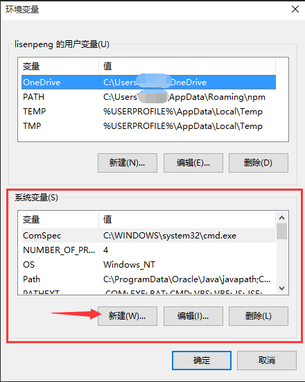

# ionic2
ionic2

## （一）安装nodejs

* 下载地址：[https://nodejs.org/en/](https://nodejs.org/en/)
* 安装好后在命令行中输入 `node -v` 和 `npm -v` 查看是否安装成功

    `Microsoft Windows [版本 10.0.10240]
    (c) 2015 Microsoft Corporation. All rights reserved. 

    C:\WINDOWS\system32>node -v
    
    v6.10.0

    C:\WINDOWS\system32>npm -v
    
    3.10.10`

* 因为国内的网络环境原因，在下载npm包的时候经常会遇到无法正常下载的情况，这时可以使用国内淘宝推出了 npm 镜像
* 输入以下命令，切换到淘宝镜像源：

    * `npm install -g cnpm --registry=http://registry.npm.taobao.org`

* 之后所有用到的 npm 命令都可以使用 cnpm 来代替进行 install。但是需要注意 cnpm 不支持 publish 命令

## （二）安装ionic2

* 输入以下命令安装 Ionic （如果设置了淘宝镜像源，可以使用 cnpm 代替 npm）：

    * `npm install -g ionic`
    
* 需要注意的是，如果之前安装过 Ionic2 beta 版本，需要先卸载掉，然后重新安装：
    
    * `npm uninstall -g ionic`

* 安装完成后查看版本号：
    * `ionic -v`
    
    `C:\Users\lsp>ionic -v
     
     2.2.1`

## （三）安装Cordova

* 输入以下命令安装Cordova (建议使用 cnpm 代替 npm)：

    * `npm install -g cordova`
    
* 安装完成后查看版本号：
    * `cordova -v`
    
    `C:\Users\lsp>cordova -v

     6.5.0`

## （四）安装JDK

* 下载JDK安装包，下载地址：[http://www.oracle.com/technetwork/java/javase/downloads/index.html](http://www.oracle.com/technetwork/java/javase/downloads/index.html)

* 安装JDK，并配置系统变量：
    1. 新建环境变量：
        * 变量名：JAVA_HOME
        * 变量值：C:\Program Files\Java\jdk1.8.0_121（JDK安装的路径）

         

        

        

        

    2. 找到系统变量Path进行编辑，在后面添加 `\;%JAVA_HOME%\bin;`
    
        

    3. 验证JDK环境变量是否配置成功
        * 在命令行中输入 `java -version` 和 `javac -versoin`

        

## （五） 安装 Apache Ant

* 下载地址：[http://mirror.tcpdiag.net/apache//ant/binaries/apache-ant-1.9.4-bin.zip](http://mirror.tcpdiag.net/apache//ant/binaries/apache-ant-1.9.4-bin.zip)
* 下载完成后解压该文件至某个安全的目录下，然后将该文件夹内的bin文件夹路径添加至系统Path环境变量中（添加方法和java配置path变量是一样的，注意以 ； 隔开每个环境变量的值）
    

* 验证Ant环境变量是否配置成功，在命令行中输入 `ant -version`

    

## （六） 安装 Android SDK

* 下载地址：[http://tools.android-studio.org/index.php/sdk](http://tools.android-studio.org/index.php/sdk)

* 安装完成后，配置系统环境变量：
    1. 新建环境变量：
        * 变量名：ANDROID_HOME
        * 变量值：C:\Program Files (x86)\Android\android-sdk（SDK安装路径）
        
        
    
    2. 编辑用户变量 Path 添加 `;%ANDROID_HOME\tools%` 
        
        

    3. 编辑系统变量 Path 添加 `%ANDROID_HOME%\platform-tools;`

        
    
* 验证SDK环境变量是否配置成功，在命令行中输入 `adb`

    

## （七） 创建项目

* 打开 Node 命令行，进入到要创建项目的目录，使用 start 命令来创建一个新App：
    * `ionic start projectName --v2` 
    
* 有可能会报错，npm 安装的时候失败
    
    

* 解决方法：进入到项目目录，使用 cnpm 命令进行下载：
    * `cd projectName`
    * `cnpm install`

    

* 进入项目目录，使用 `ionic serve` 命令，在浏览器上运行项目

    

## （八） 添加配置Android环境

* 在项目目录，添加配置 Android 环境，执行以下命令：
    * `ionic platform add android`
    
    

## （九） 打包生成 APP

* 执行以下命令，打包生成 APP
    * `ionic build android` 

## （十） 遇到的问题

* gradle 下载太慢后失败
    
    

* 解决方法：
    1. 手动下载 gradle,下载地址：[https://services.gradle.org/distributions/gradle-2.14.1-all.zip](https://services.gradle.org/distributions/gradle-2.14.1-all.zip)
    2. 将下载好的压缩包放在项目目录下的 `platforms\android\gradle` 的文件夹里
        
        

    3. 打开项目目录下的 `platforms\android\cordova\lib\builders\GradleBuilder.js` 文件，找到 `CORDOVA_ANDROID_GRADLE_DISTRIBUTION_URL` (不用对 GradleBuilder.js 文件进行修改)
        
        

    4. 在 Node 命令行中设置 `CORDOVA_ANDROID_GRADLE_DISTRIBUTION_URL` 的值为下载的 gradle, 执行如下命令：
        * `set CORDOVA_ANDROID_GRADLE_DISTRIBUTION_URL=../gradle-2.14.1-all.zip`

        

        * 设置成功
        
        

## （十） 打包成功
* 编译成功
    
    

    

* 在模拟器上运行
    
    

